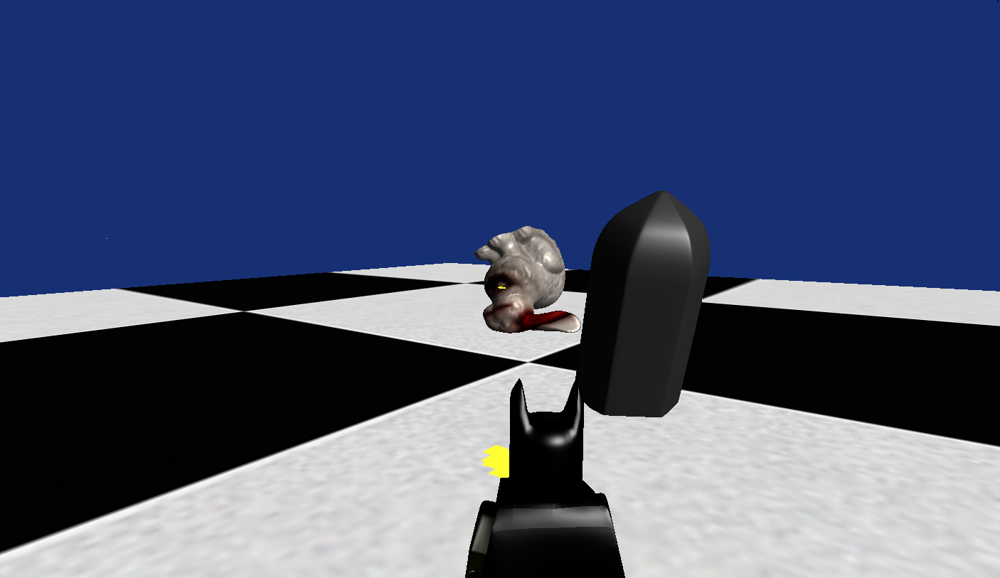
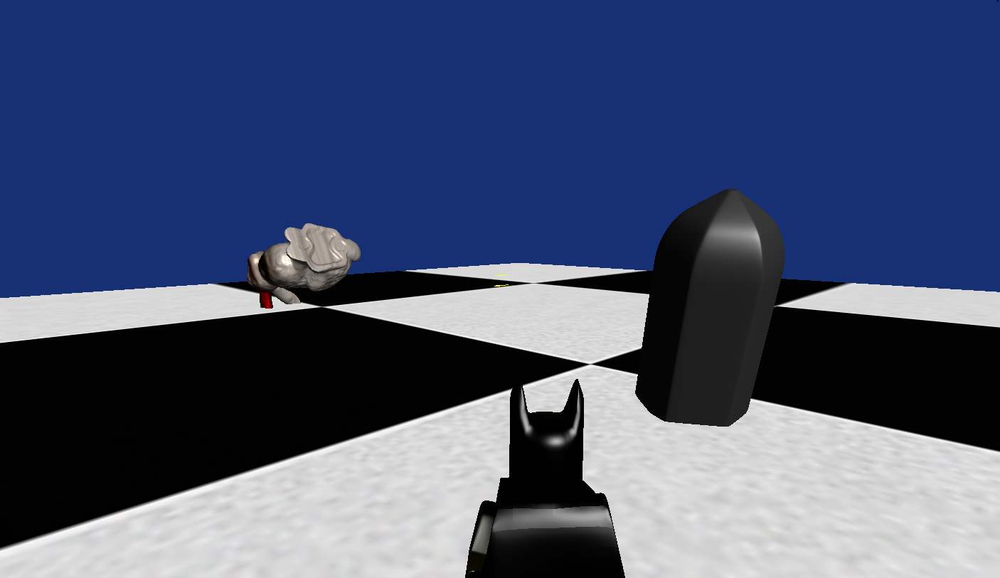

O desenvolvimento deste trabalho foi um verdadeiro desafio, mas também uma experiência muito satisfatória com um aprendizado maior pois o desenvolvimento do jogo foi sozinho. A disciplina é bastante interessante, pois pude aplicar na prática a maioria dos conceitos abordados em aula, como lógica de colisões e controlo de câmara e aplicação das texturas nos objetos, também trabalhei bastante com o blender para melhorar e facilitar a posição dos objetos no jogo.

Utilizei o ChatGPT e DeepSeek tanto para ajudar na resolução de bugs como para aperfeiçoar algumas lógicas do jogo, principalmente a de colisões , o que tornou o processo mais eficiente e produtivo.

A jogabilidade ficou bastante intuitiva e dinâmica. O movimento do personagem é controlado pelas teclas WSAD. As teclas Q e E possibilitam a rotação do personagem, e a barra de espaço serve para disparar. Este esquema de controlos torna a experiência do utilizador mais envolvente. O coelho se teletransporta a cada x segundos e se encostar tantos segundos no batman o personagem morre ou tenho que acertar y tiros pra matar o coelho.

Outro ponto é que todo o projeto foi desenvolvido em ambiente Linux, sendo a compilação feita apenas com o make e make run para rodar o jogo. Ainda ficaram algumas atividades pra terminar o jogo, como incluir o background e sua textura, incluir mais alguns objetos no jogo com colisões e também alguns efeitos adicionais que gostaria de incluir.

MANUAL
W - FRENTE
S - TRÁS
A - ESQUERDA
D - DIREITA
Q - ROTACIONA PARA ESQUERDA
E - ROTACIONA PARA DIREITA
ESPAÇO - ATIRA
ESC - SAI DO JOGO

COMPILAÇÃO

 No linux para compilar vá até o diretório raiz do projeto, abra o terminal nesse diretório. Dê um "make" e um "make run". O jogo deve funcionar normalmente.
 Ainda vou fazer os testes no windows para que também funcione bem.

